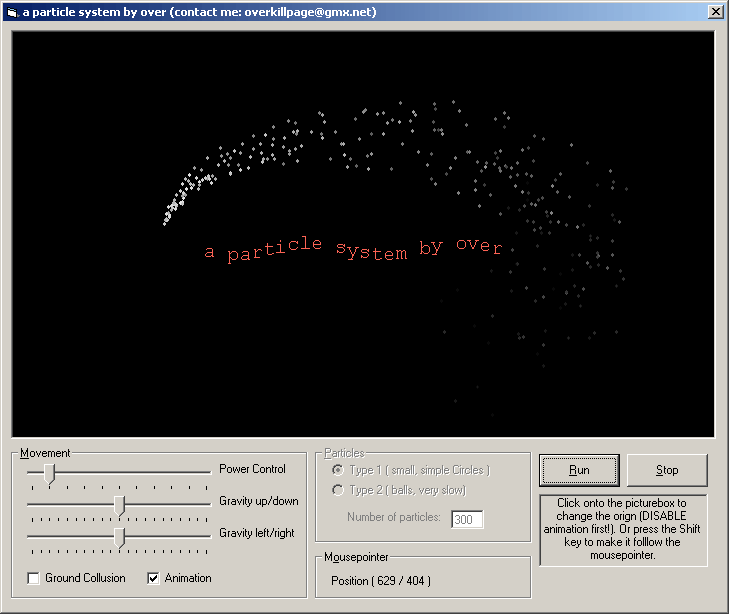



## \[\_a particle system, pure VB 1\.3\_\]

### Description

A particle system, done in pure VB. It shows how to create such an effect system. The program is not accelerated in any way and does not use DirectX or OpenGL. It just demonstrates the technique. It can be great fun to watch the animation and play arround with the gravity settings etc. ;)

  

I added some animation stuff in this version which is not necessary for the system itself but makes the code more interesting ;) If you only want to understand the basics please download version 1.1
 
### More Info
 

             |
---                |---
**Submitted On**   |2003-04-20 04:03:48
**By**             |[over](https://github.com/Planet-Source-Code/PSCIndex/blob/master/ByAuthor/over.md)
**Level**          |Intermediate
**User Rating**    |4.9 (59 globes from 12 users)
**Compatibility**  |VB 5\.0, VB 6\.0
**Category**       |[Graphics](https://github.com/Planet-Source-Code/PSCIndex/blob/master/ByCategory/graphics__1-46.md)
**World**          |[Visual Basic](https://github.com/Planet-Source-Code/PSCIndex/blob/master/ByWorld/visual-basic.md)
**Archive File**   |[\[\_a\_partic1577554212003\.zip](https://github.com/Planet-Source-Code/over-a-particle-system-pure-vb-1-3__1-44932/archive/master.zip)

